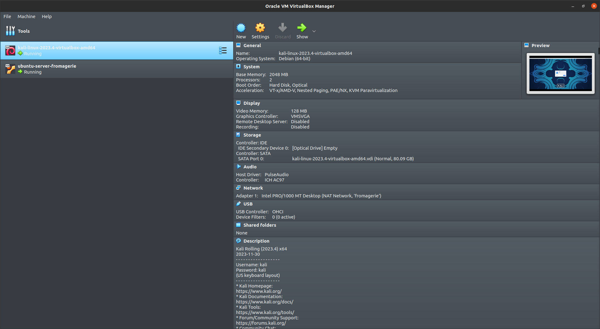
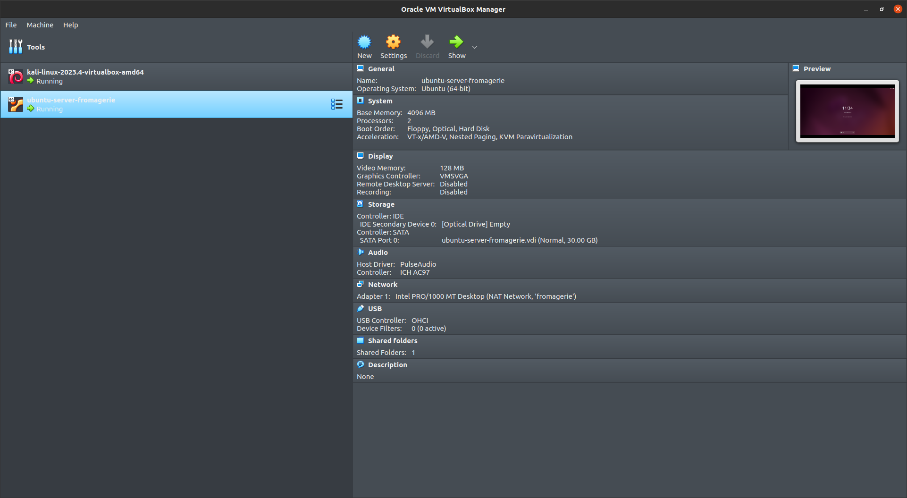
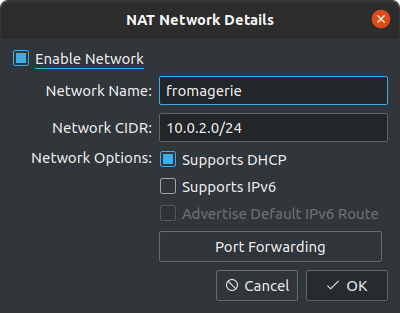
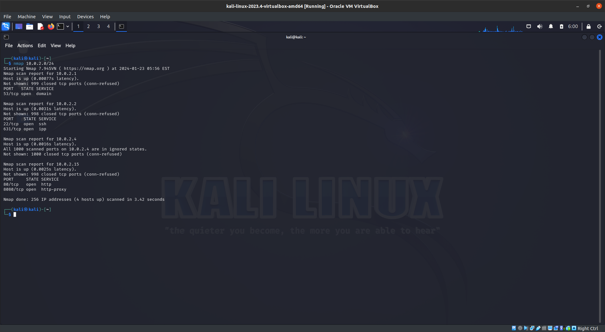
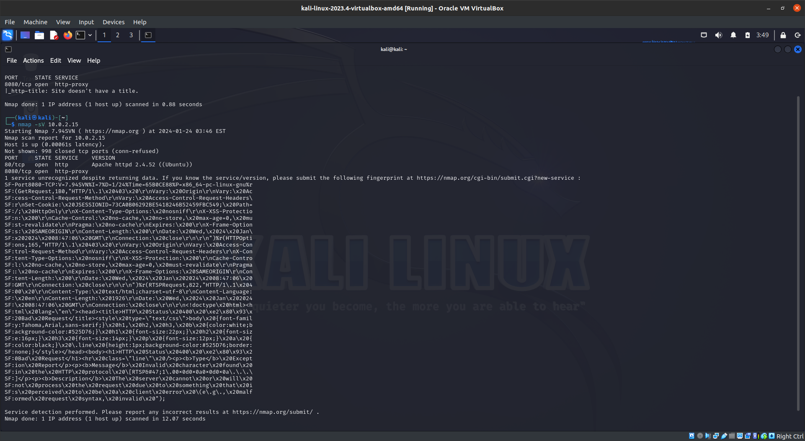

# Audit sur la securité du projet fromagerie

## Mise en place de l'environement

### Installation

on utilise 2 machines virtuelles pour effectuer no tests d'intrusion

une machine kali linux


une machine ubuntu


### Configuration

apres avoir installer les 2 machines virtuelles on les connecte sur le meme reseau



sur le server dans le dossier home on place le projet que l'on va monter avec le makefile ci-dessous
nous permettant egalement d'installer docker et docker compose

[Makefile](./Makefile)

```Makefile
db:
 docker compose up

app:
 mvn clean spring-boot:run

peek:
 docker logs -f db

down:
 docker compose down

purge:
 docker compose down -v 

docker:
# remove old docker versions if any
 for pkg in docker.io docker-doc docker-compose docker-compose-v2 podman-docker containerd runc; do sudo apt-get remove $$pkg; done
 sudo apt-get autoremove

# install docker certificates
 sudo apt-get update
 sudo apt-get install ca-certificates curl gnupg
 sudo install -m 0755 -d /etc/apt/keyrings
 curl -fsSL https://download.docker.com/linux/ubuntu/gpg | sudo gpg --dearmor -o /etc/apt/keyrings/docker.gpg
 sudo chmod a+r /etc/apt/keyrings/docker.gpg

# add docker repository
 echo "deb [arch=$$(dpkg --print-architecture) signed-by=/etc/apt/keyrings/docker.gpg] https://download.docker.com/linux/ubuntu \
  $$(. /etc/os-release && echo "$$VERSION_CODENAME") stable" | \
  sudo tee /etc/apt/sources.list.d/docker.list > /dev/null

# install docker
 sudo apt-get update
 sudo apt-get install docker-ce docker-ce-cli containerd.io docker-buildx-plugin docker-compose-plugin

# add user to docker group
 sudo groupadd docker
 sudo usermod -aG docker $$USER
 newgrp docker

```

le ficher docker-compose.yml nous permet de monter la base de donner et de l'initialiser avec le script [init.sql](./database/fromagerie_com_springBoot.sql)

[docker-compose.yml](./docker-compose.yml)
  
```yml
version: 'alpha'

services:
  db:
    container_name: db
    hostname: db
    image: mysql:latest
    environment:
      MYSQL_USER: thibault_test
      MYSQL_PASSWORD: password
      MYSQL_ALLOW_EMPTY_PASSWORD: 'yes'
    ports:
      - 8889:3306
    volumes:
      - ./database/fromagerie_com_springBoot.sql:/docker-entrypoint-initdb.d/fromagerie_com_springBoot.sql
      - data:/var/lib/mysql

  adminer:
    container_name: adminer
    hostname: adminer
    image: adminer:latest
    ports:
      - 8890:8080

volumes:
  data:

networks:
  default:
    name: fromagerie

```

pour installer docker on lance la commande suivante puis on redemarre la session utilisateur en cours

```bash
make docker
```

### Lancement

pour tout lancer les commandes suivantes a la racine du projet dans 2 terminal diffent

```bash
make db
```

```bash
make app
```

## Audit

sur kali on lance la commande suivante pour scanner les appareils connecter sur le reseau ainsi que leur port ouvert
on utilisera l'adresse ip du reseau virtuel (10.0.2.0/24) pour cela

on considere pour cette analyse 2 acteurs:

- un attaquant externe avec le client communiquant avec la cible
- la cible exposant un port sur le reseau

```bash
nmap 10.0.2.0/24
```

on constate une machine avec le port 8080 ouvert


### Analyse preliminaire du port 8080

on lance la commande suivante pour scanner le port 8080

```bash
nmap -sV 10.0.2.15
```

on peu constater ci-dessous que le port 8080 est ouvert et que le service qui tourne dessus est un serveur web apache httpd


on va donc proceder a une analyse des routes en supposant d'abord que le serveur est un serveur apache tomcat

### Analyse des routes

on utilisera le logiciel burp suite pour analyser les routes du serveur
